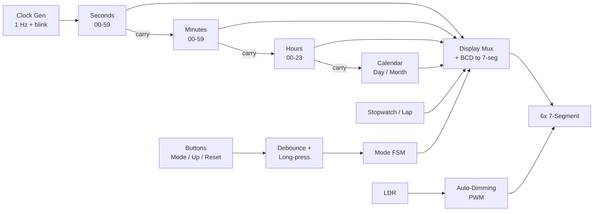
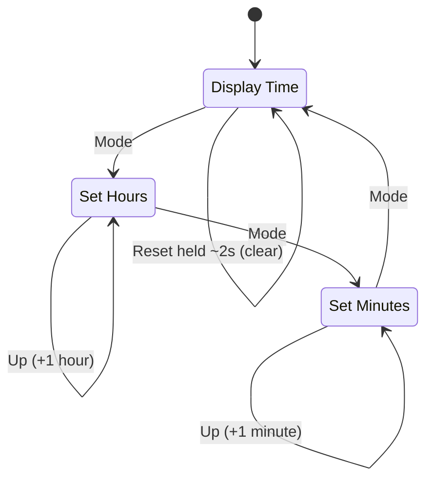

# Advanced Digital Clock — Pure 74-Series Logic (Proteus)

A complete **24-hour digital clock** — with a calendar, a stopwatch, and ambient auto-dimming — built from nothing but **raw 74-series logic chips**. No microcontroller. No firmware. No code. Just gates, flip-flops, counters, decoders, and multiplexers, wired into a working machine and simulated in **Proteus 8**.

Final project for the **Logic Circuits** course, Department of Computer Engineering, **Ferdowsi University of Mashhad**.

---

## Highlights

- Full `HH:MM:SS` 24-hour time on six seven-segment displays.
- A **hand-built finite-state machine** drives the whole UI from just three buttons — no MCU, no lookup ROM.
- A **self-correcting calendar** that knows 30- vs 31-day months and handles leap years automatically.
- A **stopwatch with lap** that freezes the display while still counting in the background.
- **Ambient-aware brightness** via an LDR and a PWM dimming technique.
- Cleanly organized into **~22 reusable sub-circuits** for a readable top sheet.

---

## Features

### Core
- **24-hour time** — `HH:MM:SS` across six 7-segment displays.
- **Smart FSM** — three buttons (`Mode`, `Up/Set`, `Reset`) cycle through *Display -> Set Hour -> Set Minute*.
- **Blinking set mode** — the field being edited blinks while `Up` increments it.
- **Short vs. long press** — holding `Reset` for ~2 s triggers a full reset, distinct from a tap.

### Optional modules (implemented)
- **Complex Calendar** — day/month tracking with automatic 30/31-day detection.
- **Stopwatch & Lap** — captures a lap by freezing the display while counting continues underneath.

### Bonus
- **Leap-year logic** — Esfand automatically switches between 29 and 30 days.
- **Auto-Dimming** — display brightness adapts to ambient light via **LDR** + **PWM**.

---

## System Architecture

Signal flow across the ~12 functional modules:

| # | Module | Role |
|---|--------|------|
| 1 | Clock generator | 1 Hz tick + slow blink clock |
| 2-4 | Seconds / Minutes / Hours | Cascaded BCD counters with rollover |
| 5 | FSM / mode controller | Display / Set-Hour / Set-Minute / Calendar / Stopwatch |
| 6 | Button conditioning | Debounce + edge + long-press detection |
| 7 | Blink / set logic | Blinks the field under edit, gates `Up` pulses |
| 8 | Display mux + decoder | Selects source and drives the six 7-segments |
| 9 | Calendar | Day/month counters with 30/31-day detection |
| 10 | Leap-year unit | Esfand 29/30-day selection |
| 11 | Stopwatch / Lap | 0.1 s resolution, freeze-on-lap |
| 12 | Auto-dimming | LDR + PWM brightness control |

---

## Control FSM

The interface is a small state machine cycled by the `Mode` button. In a *set* state the active field blinks and `Up` increments it; a long `Reset` returns to a cleared display from anywhere.

---

## Design Constraints

These rules are what make the project a logic-design exercise rather than a coding one:

- No microcontroller (Arduino, 8051, AVR ...) and no ROM/EPROM for the core logic.
- Only gates, flip-flops, counters, decoders, multiplexers, and 74-series ICs.
- Counter/FSM logic built **by hand** — no built-in Proteus counter modules.
- Every connection uses **net labels**, and the logic is split into **sub-circuits**.

---

## ICs Used

| IC | Role |
|----|------|
| 74xx160 / 74xx161 | Decade / binary counters (time, calendar, stopwatch) |
| 74HC14 | Schmitt-trigger inverter — oscillator & button debounce |
| 74LS47 | BCD to 7-segment decoder/driver |
| 74HC74 / 74LS74 | D flip-flops — FSM state |
| 74LS112 | JK flip-flop |
| 74HC85 | Magnitude comparator — rollover / value matching |
| 74HC153 / 74HC157 | Multiplexers — display source selection |
| 74HC125 | Tri-state buffers — bus sharing between modes |
| 74HC173 | D registers / latches |
| 74HC08 / 74HC04 / 7410 | AND / NOT / NAND glue logic |
| 74HC238 / 74HC147 | Decoder / priority encoder |
| 7SEG-COM-ANODE x6 | Time / value display |
| LDR | Ambient-light sensing for auto-dimming |

---

## Getting Started

1. Open `final_project.pdsprj` in **Proteus 8.0+**.
2. Press **Play** to start the simulation.
3. Use the on-sheet buttons:

| Button | Short press | Long press (~2 s) |
|--------|-------------|-------------------|
| **Mode** | Move to the next mode | — |
| **Up / Set** | Increment the selected (blinking) field | — |
| **Reset** | — | Full reset |

---

## What This Project Demonstrates

- Sequential and combinational digital design from first principles.
- Finite-state-machine design and implementation **in hardware**.
- Counter chains, BCD arithmetic, and modulo / rollover logic.
- Multiplexed display driving and decoder design.
- Real-world signal conditioning: debouncing, edge and long-press detection.
- Hierarchical, modular schematic design using sub-circuits.

---

## Author

**Yahya Mohammadzadeh** — Computer Engineering, Ferdowsi University of Mashhad
[github.com/yahya-mz](https://github.com/yahya-mz)
